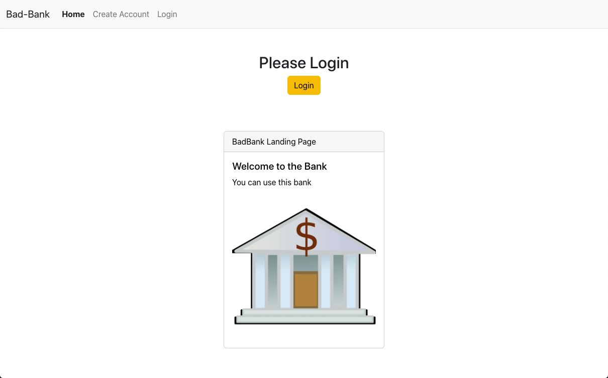
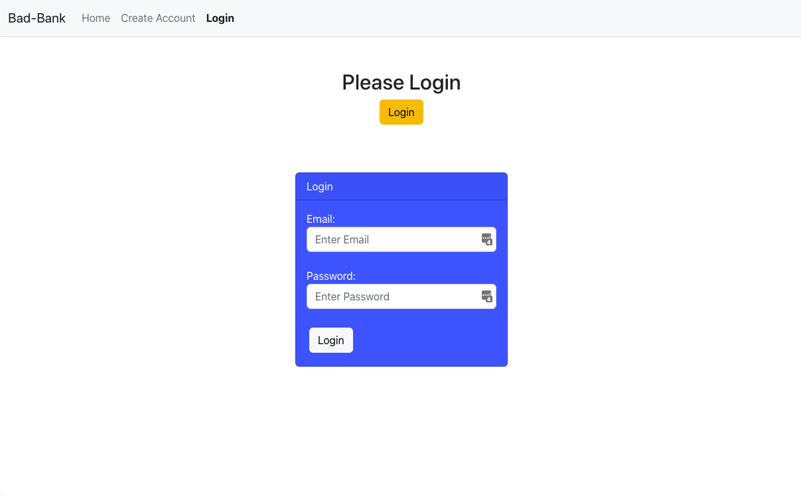
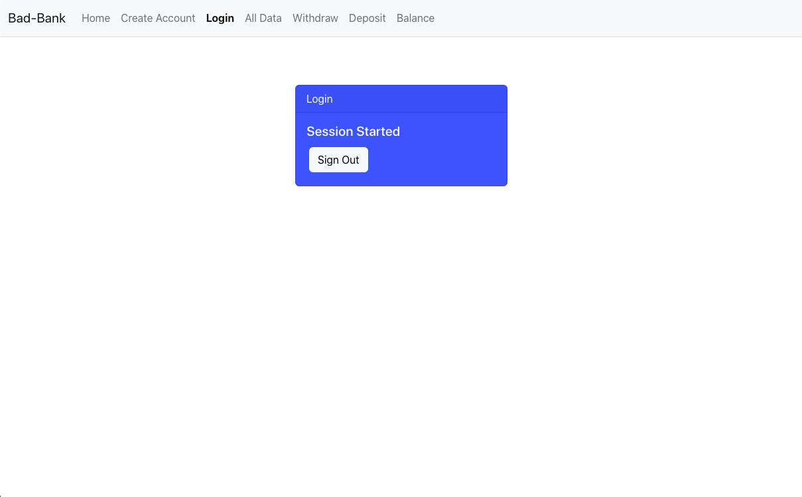
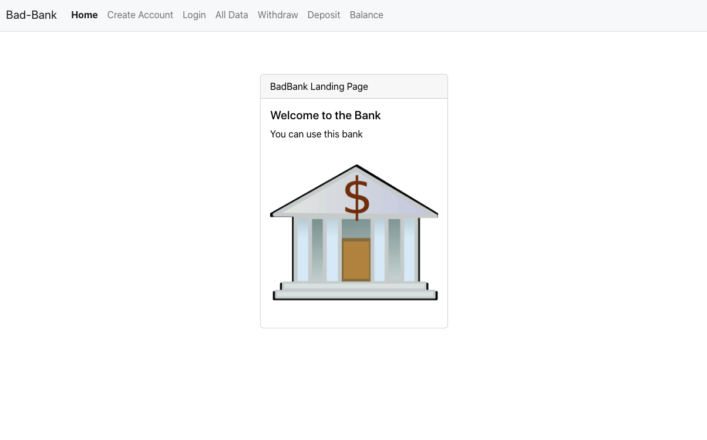
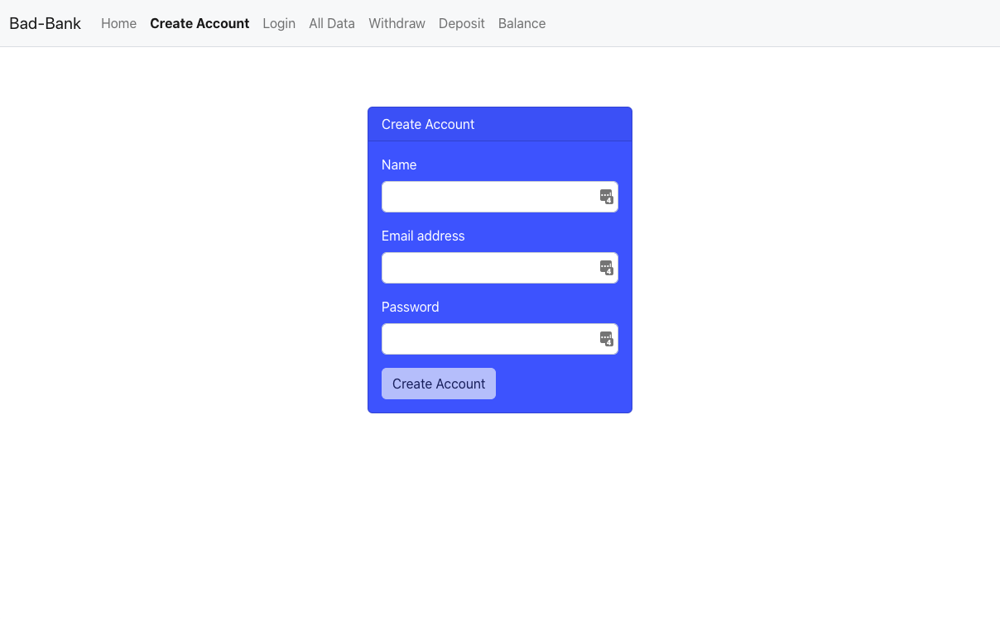
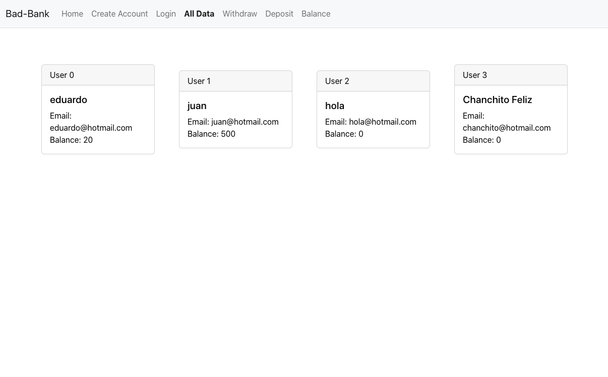
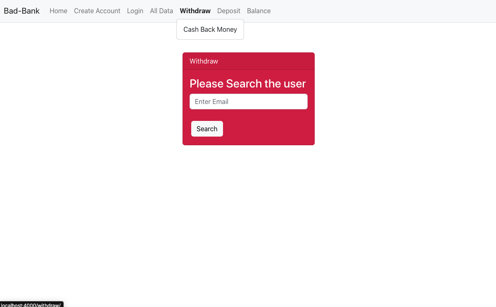
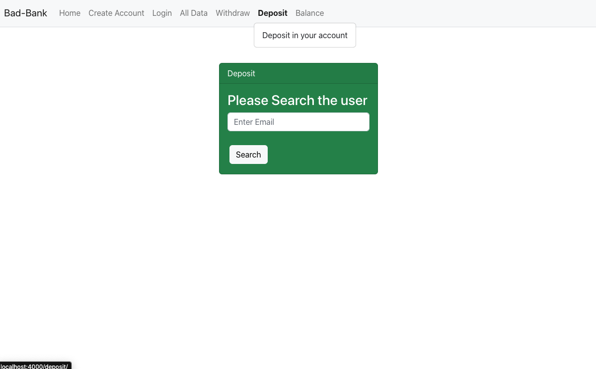
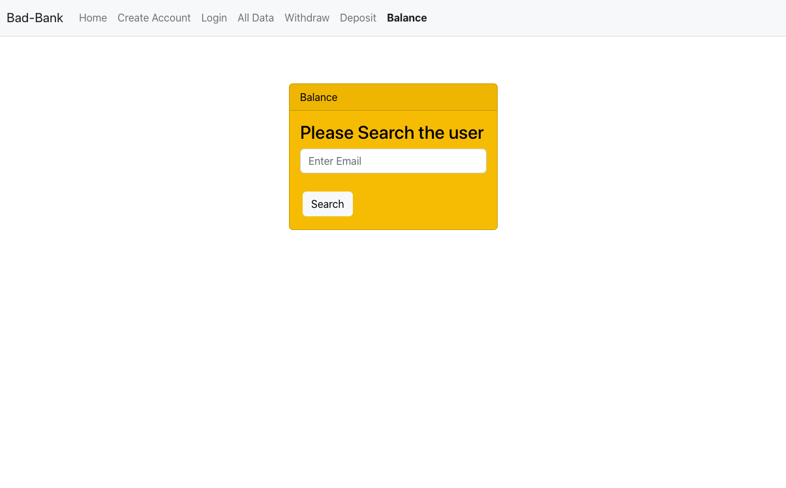

# <h1 align="center">Bank Project</h1>

<p align="center">
  <a href="#dart-description">Description</a> &#xa0; | &#xa0; 
  <a href="#art-technologies">Technologies</a> &#xa0; | &#xa0;
  <a href="#toolbox-installation">Installation</a> &#xa0; | &#xa0;
  <a href="#camera_flash-screenshots">Screenshots</a> &#xa0; | &#xa0;
  <a href="#memo-features">Features</a> &#xa0; | &#xa0;
  <a href="#briefcase-license">License</a> &#xa0; | &#xa0;
  <a href="https://github.com/eduardo-ortiz09" target="_blank">Author</a>
</p>

<br>


## :dart: Description ##

Bank App made with MongoDB, Express, React and Node.js


## :art: Technologies ##

### Client

- [Create React App](https://create-react-app.dev/)
- [HTML](https://www.w3schools.com/html/)
- [CSS](https://www.w3schools.com/css/)
- [Bootstrap5](https://getbootstrap.com/)
- [JavaScript](https://www.w3schools.com/js/)
- [React](https://reactjs.org/)
- [Firebase](https://firebase.google.com/)

### Server

- [Create React App](https://create-react-app.dev/)
- [Node.js](https://nodejs.org/)
- [Express](https://expressjs.com/)
- [Docker](https://www.docker.com/)
- [MongoDB](https://mongodb.com/)
- [Firebase Admin](https://firebase.google.com/)


## :toolbox: Installation ##

For this project you will need firebase project created


Install MongoDB with Docker

```bash
$ docker run -p 27017:27017 --name bank-project -d mongo
```

Clone Repository

```bash
$ git clone https://github.com/eduardo-ortiz09/bank-project.git
```

Go to directory for client

```bash
$ cd bank-project-front
```

Install the dependencies

```bash
$ npm install 
```

Go to src

```bash
$ cd src 
```

Create a conf-firebase.js file

Go to the console.firebase > settings of project > general > create new app

Copy the SDK configuration

Your file most be like this

```javascript
// Import the functions you need from the SDKs you need
import { initializeApp } from "firebase/app";
// TODO: Add SDKs for Firebase products that you want to use
// https://firebase.google.com/docs/web/setup#available-libraries

// Your web app's Firebase configuration
const firebaseConfig = {
  apiKey: "asdfasdfasdfas",
  authDomain: "asdfasdfasdfas.firebaseapp.com",
  projectId: "asdfasdfasdfas-54d68",
  storageBucket: "asdfasdfasdfas-54d68.appspot.com",
  messagingSenderId: "adsfasdfasdf",
  appId: "asdfasdf"
};

// Initialize Firebase
const conf = initializeApp(firebaseConfig);

export default conf;

```

Create a project for production

```bash
$ npm run build
```

Rename "build" directory 

```bash
$ mv build public
```

Copy "public" directory in "bank-project-back"

```bash
$ cp -r public ../bank-project-back/public
```

Go to "bank-project-back" directory

```bash
$ cd ../../bank-project-back
```

Install the dependencies

```bash
$ npm install 
```

Create a key.json file

Go to the console.firebase > settings of project > accounts of services > generate a new private key

Create a admin.js file

```javascript
var admin = require("firebase-admin");

var serviceAccount = require("./key.json");

admin.initializeApp({
  credential: admin.credential.cert(serviceAccount)
});

module.exports = admin;

```
Run the server

In the "bank-project-back" run the comand

```bash
$ npm start
```


## :camera_flash: Screenshots

<div align="center">
  
  
  
  
  
  
  
  
  
</div>

## :memo: Features ##

These are the list of currect improvements:

- :no_entry: Improve the security.	
- :no_entry: Add more collections for database.	
- :no_entry: Create a interface for profile.	
- :no_entry: Add roles.	

## :briefcase:	 License ##

This project is under license from GNU. For more details, see the [LICENSE](LICENSE) file.


Made with :heart: by <a href="https://github.com/eduardo-ortiz09" target="_blank">Eduardo Ortiz</a>

&#xa0;

<a href="#top">Back to top</a>


